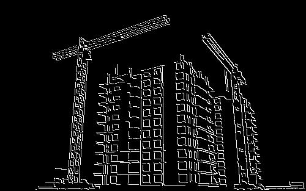

# Canny Edge Detector

### How to run ?
- Place your intended images inside the `data/` folder to use the implementation or set the path your folder (containing images) in [config.yaml](./src/config.yaml).
- Example run :

    `c = CannyEdgeDetector(config_file_path='config.yaml')`

    For a list of images inside a directory, use 
    `c.detect_edges()`

    For a single image , use 
    `c.detect_edge_of_image("test.jpg")`
- An example notebook is observed in [test.ipynb](./src/test.ipynb)
- You will observe the output edge detected image files in the folder `outputs/`.
- You could modify the [config.yaml](./src/config.yaml) file to modify the configuration settings and the canny edge parameters.

## Example 01

    

        
    

    

        
    

## Example 02

    

        
    

    

        
    

## Example 03

    

        
    

    

        
    

## Example 04

    

        
    

    

        
    

## Example 05

    

        
    

    

        
    

